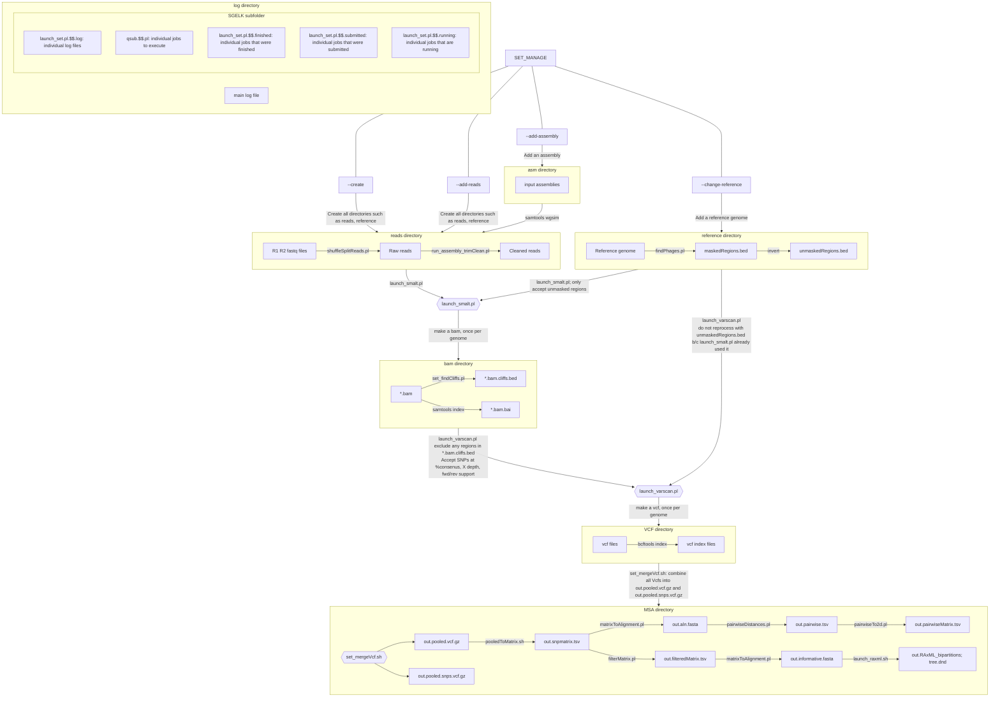

Below is a visualization of the workflow with output files.
Then in the next section, a table with the description of all output files.

Visualization of output files
=============================

Output files
============
| File    |   Description  | Notes |
|:--------|:---------------|:------|
|project/msa | The multiple sequence alignment directory | Most of the output files you want are here like the multiple sequence alignment and the phylogeny|
|`project/msa/out.pooled.vcf.gz` | The pooled VCF file created from `bcftools merge` | 
|`project/msa/out.pooled.snps.vcf.gz` | SNPs vcf | The same data as `out.pooled.vcf.gz` but filtered to SNPs only. |
|`project/msa/out.pooled.vcf.gz.tbi`, `out.pooled.snps.vcf.gz.tbi` | the tabix index file for each VCF | 
|`project/msa/out.snpmatrix.tsv` | The `bcftools query` output | This file is essentially the main SNP matrix and describes the position and allele for each genome.  Each allele is in the genotype (GT) format, as specified in the vcf format specification |
|`project/msa/out.filteredMatrix.tsv` | The filtered `bcftools query` output | After `out.snpmatrix.tsv` is generated, this file describes remaining SNPs after some are filtered out, usually because the `--allowedFlanking` option in `launch_set.pl`, `--allowed` in `filterMatrix.pl`, or similar parameters in other scripts |
|`project/msa/out.aln.fasta` | The output alignment file in fasta format. | Make any changes to this file before running a phylogeny |program.  Do not use `out.informative.fasta` to make edits because positions might come and go and therefore you might lose resolution. After any edits, use `removeUninformativeSites.pl` to re-create `out.informative.fasta`  |
| `project/msa/out.informative.fasta` | The alignment after removing uninformative columns (ambiguities, invariants, gaps) | Do not make any changes to this file before running a phylogeny. Make the changes in `out.aln.fasta` |
| `project/msa/out.RAxML_bipartitions` | RAxML-generated tree in newick format | 
| `project/msa/tree.dnd` | Symlink to `out.RAxML_bipartitions`| 
| `project/msa/out.pairwise.tsv` | Pairwise distances file | Format: tab-delimited with three columns: genome1, genome2, hqSNP distance |
| `project/msa/out.pairwiseMatrix.tsv` | Pairwise distances matrix | The same data as `out.pairwise.tsv`, but in a 2-d matrix. Generated with `pairwiseTo2d.pl`. |
|project/log| Log files|
|`project/log/launch_set.log`    | The main log file |
|project/asm, project/reads || The input assemblies and reads. |
|project/reference | Where the reference fasta file is|
|`project/reference/maskedRegions.bed` | Regions of the reference genome that is masked for analysis. |
|project/reference/maskedRegions | BED-formatted files that describe regions that should be masked in the reference genome.|  You may also create your own file that can have any filename with extension `.bed`. This file can describe your manually-chosen regions that should be masked.  These regions will be incorporated into `project/reference/maskedRegions.bed`.|
|`project/reference/maskedRegions/phages.bed`| BED-formatted file describing predicted phage sites||
|project/bam| Output bam files are here|
|`project/bam/*.sorted.bam` | Sorted bam files | The query and reference name are encoded in the filename; many times the reference name will just be called "reference." |
|`project/bam/*.sorted.bam.bai` | Samtools index file |
|`project/bam/*.sorted.bam.cliffs.bed` | Files describing genome depth cliffs | These are only present if you specified `--mask-cliffs` |
|project/vcf |VCF files|Have the same file format as the `*.sorted.bam` files, so that they can be matched easily when running Lyve-SET. These files are sorted with vcftools and compressed with bgzip.|
|`project/vcf/*.vcf.gz`|VCF files ||
|`project/vcf/*.vcf.gz.tbi`| Tabix index files|
